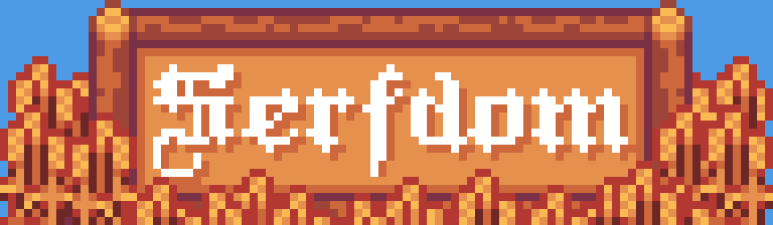
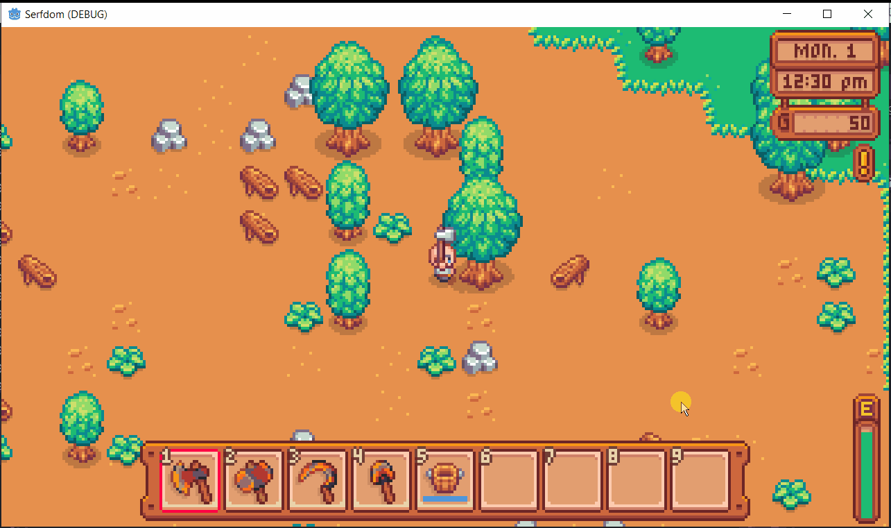
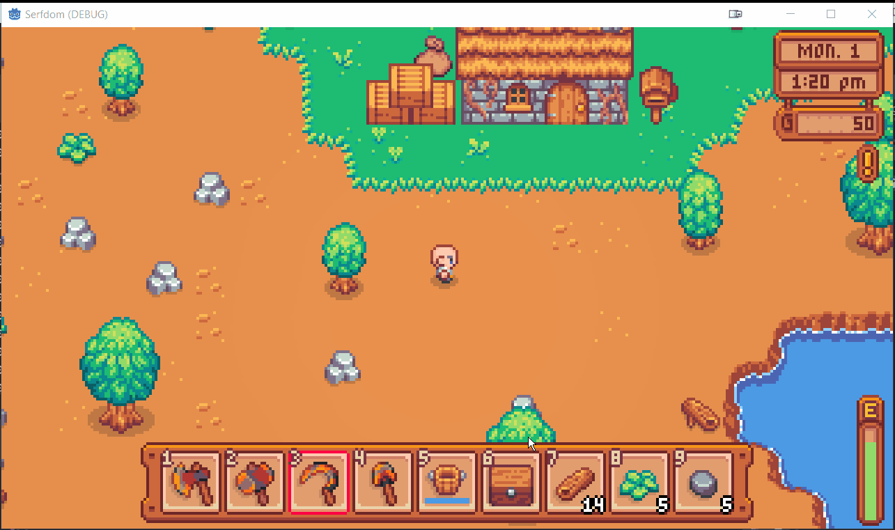
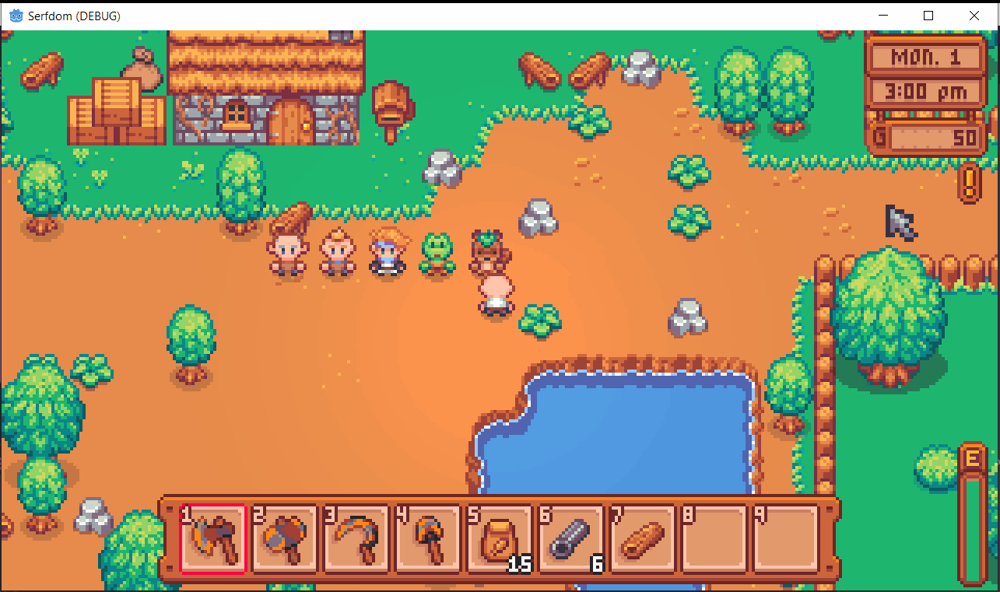

Hammer or Sickle?

Join your fellow peasants to revolution, or side with the monarchy to crush the rebellion. Gather resources, grow crops, and build relationships with the townsfolk. Developed in Godot 4

Art by jamiebrownhill (and me knocking off other games for temp art)

**Very early development, it doesn't do much yet.**

## Implemented Systems:
Using tools to gather resources from rocks, trees and greenery

Planting, growing and harvesting crops

Dynamic day/night lighting and shadows

Irrigation pipes

Managing inventory with chests

NPCs & Dialogue

## To Be Developed:
- Almost everything (crafting, quests, story, economy, etc.)

**note:** this repo is for education/archival purposes. It won't run without the art and sound assets, and I don't have the rights to distribute them outside of the game itself. You can download a playable version from the Itch page: https://joshmitcho.itch.io/serfdom
