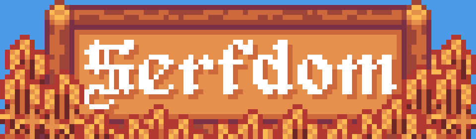

Hammer or Sickle?

Join your fellow peasants to revolution, or side with the monarchy to crush the rebellion. Gather resources, grow crops, and build relationships with the townsfolk. Developed in Godot 4

Art by jamiebrownhill (and me knocking off other games for temp art)

**Early development, it doesn't do much yet.**

## Implemented Systems:
Using tools to gather resources from rocks, trees and greenery

Planting, irrigating and harvesting crops

NPCs & Dialogue

Crafting

Managing inventory with chests

Dynamic day/night lighting and shadows

## To Be Developed:
- Procedurally Generated Caves & Forests (in progress)
")

- Quests
- NPC Relationships & Allegiance
- Economy
- Cutscenes
That should be enough systems to release a true vertical slice of the game as a demo, then I can get started filling out the actual content.

**note:** this repo is for education/archival purposes. It won't run without the art and sound assets, and I don't have the rights to distribute them outside of the game itself. You can download a playable version from the Itch page: https://joshmitcho.itch.io/serfdom
